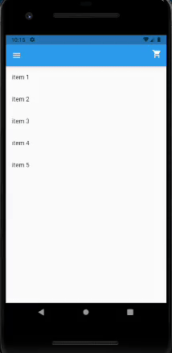

# Generic Shopping Cart

Project done during Raro Academy course, as the fifth assignment (LevelUP5)

## About the application

This project consists of a generic shopping cart.

### Functionalities
- Add item to shopping cart
- Change item quantity
- Remove item from shopping cart

### Packages used
- [mobx](https://pub.dev/packages/mobx)
- [flutter_mobx](https://pub.dev/packages/flutter_mobx)
- [mobx_codegen](https://pub.dev/packages/mobx_codegen)
- [build_runner (dev dependency)](https://pub.dev/packages/build_runner)

## To Do
- [ ] Add some design
- [ ] Test in different size screens
- [ ] Test in iOs devices
